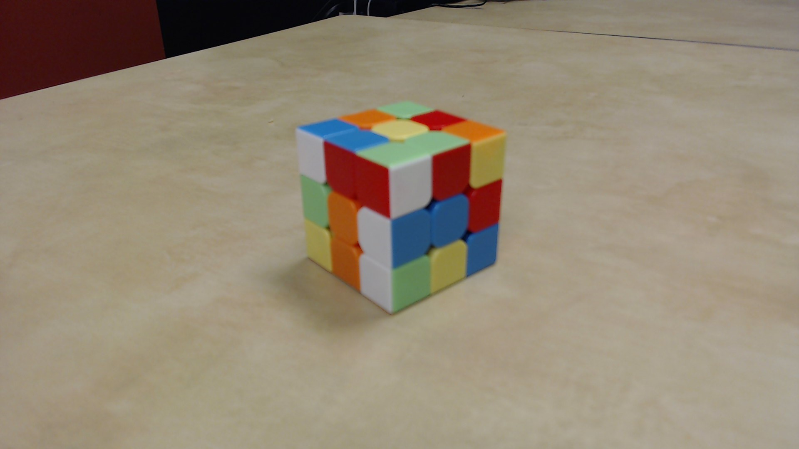
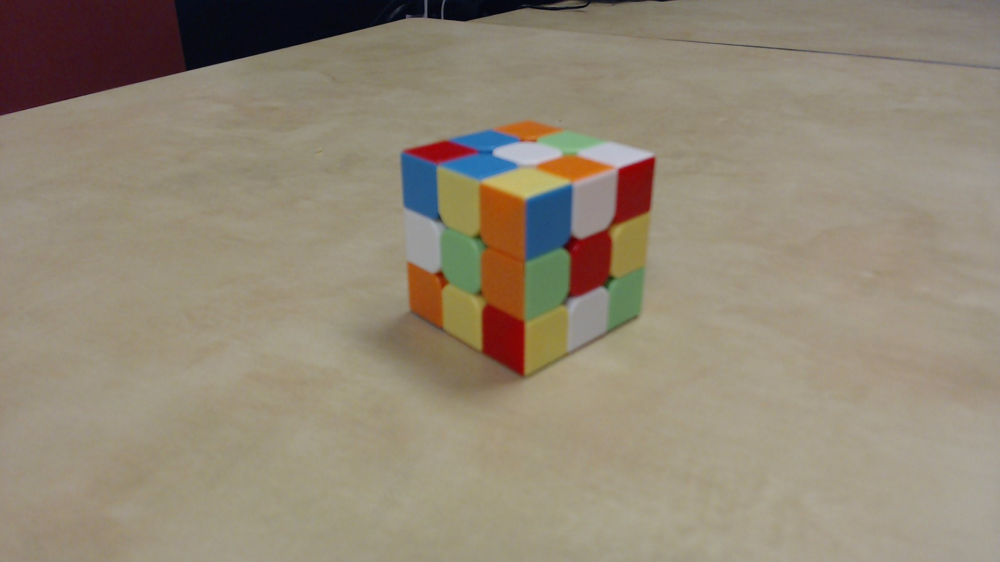

# dCubed

The world's first Rubik's Cube solver that scans with only two photos.

## Example

Take two photos:

| Yellow, orange, blue side                 | White, green, red side                    |
|-------------------------------------------|-------------------------------------------|
|  |  |

Will produce scan and solve instructions that match the photos:

 